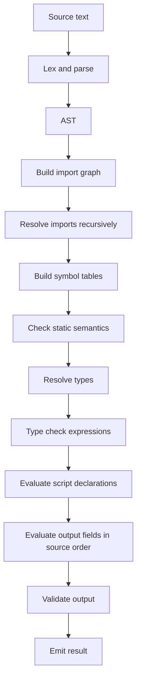

import { Aside } from "@astrojs/starlight/components"


# Mace Language Specification

Mace is a deterministic typed configuration language for constructing structured record data and schema definitions.
It's created to enforce type safe record construction and schema validation.
It's designed for developers to document and validate their configuration data.
The term Mace stands for **Main Application Configuration Engine**.

This language is intended to ensure:

- Type safety
- Clear diagnostics
- No subversion of normative language behavior
- No arbitrary code execution
- Immutability
- Schema-validated runtime input
- Well documented config files 
- No implicit scalar reinterpretation


## Scope

Mace is a deterministic typed configuration language for constructing structured record data and schema definitions.

This specification defines:

- source text structure
- lexical grammar
- syntactic grammar
- static semantics
- type semantics
- evaluation semantics
- validation behavior
- import resolution
- processing requirements
- diagnostics and security boundaries.

This specification does not define:

- arbitrary code execution
- host-language interoperability APIs
- filesystem mutation
- networking behavior
- process execution
- asynchronous execution
- or implementation-specific runtime storage.

Mace processors evaluate source text deterministically and emit structured data or schema representations.

The emitted representation format is implementation-defined unless explicitly specified by the host environment.

## Conformance

A mace document is a document that: 
- Conforms to the DSL of mace! 
- It must be able to have a script block and an output block
	- The script block must always come before the output block
	- The script block must be optional 
	- The output block must always exist in the document to be parse able
- Output directives are placed before the output block 
	- They are optional 
	- Must only produce data if there are no directives

A Mace document must conform to these aspects of mace 
  - [lexical grammar](#lexical-grammar) 
  - [syntax](#syntactic-grammar) 
  - [type system](#type-system) 
  - [evalutation semantics](#evaluation-semantics)


The rest of the sections are about how Mace is implemented. It's best to think of the rest of the sections as advice, but may and must are mandatory rules!

## Terminology

When talking about Mace pay attention to these terms below. They are here to specify how mace is going to be talked about! Other than these terms! Take everything literally

MUST
: this behavior or thing is required to do
MUST NOT
: this behavior or thing is required not to do 
SHOULD
: you are obligated to implement this behavior or thing,
SHOULD NOT
: you are obligated to not implement this behavior or thing  
MAY
: you can do this if you want to  


**We are going to talk about the data structures in Mace using the below terms:**

**record** 
: is a runtime value consisting of named fields. Each field has a field name and a field value. Field names are unique within the same record.  
  
**schema** 
: is a named record shape. A schema defines which fields an record **MAY** contain, the type of each field, and whether each field is required or optional.  
  
 **field** 
 : a named entry inside an record or schema. In an record, a field contains a value. In a schema, a field declares an expected value type.  
  
 **array**
  an ordered sequence of elements. Array elements are addressed by zero-based integer index.
## Source Text

### Encoding

Mace source text SHALL be encoded as UTF-8.

A processor MUST decode the input as UTF-8 before lexical analysis or parsing.
If the input contains invalid UTF-8 byte sequences, the processor MUST report
a source text error.

A byte order mark, if present at the beginning of the file, **MAY** be ignored.
A byte order mark elsewhere in the file is treated as source text.

### Unicode

String literals **MAY** contain Unicode characters directly, including emoji,
non-ASCII letters, symbols, and characters from non-English writing systems,
unless prohibited by the specific string literal form.

Unicode support applies primarily to string values. It does not imply that every  
Unicode character is valid everywhere in Mace syntax.

Identifiers, keywords, directive names, operators, and delimiters are matched  
according to the lexical grammar. Processors MUST NOT treat visually similar  
Unicode characters as equivalent.

Mace processors MUST NOT normalize Unicode text during parsing or evaluation.  
Two strings that differ by Unicode code point sequence are distinct, even if  
they appear visually similar.

String literals **MAY** use Unicode escape sequences to represent characters by  
code point.

Mace supports the following Unicode escape forms in string literals:

- `\uXXXX`, where `XXXX` is exactly four hexadecimal digits.
- `\UXXXXXXXX`, where `XXXXXXXX` is exactly eight hexadecimal digits.

A Unicode escape represents the Unicode code point with that value.
Unicode escapes MUST NOT encode invalid Unicode code points.

The following Unicode escape values are invalid:
- values greater than `U+10FFFF`
- surrogate code points from `U+D800` through `U+DFFF`

Invalid Unicode escape sequences MUST be reported as string literal errors.
### Line Endings

A line terminator is one of the following sequences:

- LF, U+000A
- CRLF, U+000D followed by U+000A
- CR, U+000D

For parsing purposes, all line terminators are treated as newlines. A CRLF
sequence counts as a single newline.

Processors SHOULD preserve the original line ending style for source-to-source
tools such as formatters and code actions when practical.

### Whitespace

Outside of string literals, block strings, comments, and inline declaration
descriptions, whitespace is used only to separate tokens and has no semantic
meaning.

Mace recognizes the following whitespace characters outside string content:

- space, U+0020
- horizontal tab, U+0009
- line terminators

Whitespace **MAY** appear between tokens unless prohibited by a specific grammar
rule.

## Lexical Grammar

The *lexical grammar* of Mace defines the tokens recognized by the language
before parsing. These tokens include identifiers, keywords, literals, strings,
numbers, comments, operators, and punctuation.

Whitespace separates tokens but is otherwise insignificant except where it is
part of a string literal or required to disambiguate comments.

*Identifiers* name user-defined declarations and fields, including types,
schemas, choice aliases, variables, imported symbols, and record fields.

An identifier must begin with a Unicode letter. After the first character, it **MAY** contain Unicode letters, Unicode digits, or `_`.

Identifiers are case-sensitive. The identifiers `Name`, `name`, and `NAME`
are distinct. 

The user can only write them in, snake, pascal, or camel case.  

Keywords are not valid identifiers unless explicitly defined as contextual
keywords by the grammar.


The reserved keywords are:

`from`, `import`, `alias`, `schema`, `choice`, `string`, `int`, `float`,
`boolean`, `array`, `fusion`, `variant`, `nullable`, `null`, `gen_doc`,
`schema_doc`, `true`, `false`, and `in`.

`output`, `data`, `parse`, `parse_file`, and `schema_file` are contextual
directive words and remain valid identifiers everywhere else.

Keywords are case-sensitive.

A *literal* is a source form that directly represents a value.

Mace supports string, integer, floating-point, boolean, array, and record
literals

Mace supports three string literal forms:

- single-quoted strings: `'...'`
- double-quoted strings: `"..."`
- triple-double-quoted block strings: `"""..."""`

Single-quoted strings do not support interpolation.

Double-quoted strings and block strings support interpolation using `$(...)`.  
The expression inside `$(...)` is parsed as a Mace expression and must resolve  
to a runtime value. Type references are not valid interpolation expressions.

Inline strings must not span multiple lines. Block strings **MAY** span multiple  
lines.

Supported escapes are `\\`, `\'`, `\"`, `\n`, `\r`, and `\t`.

Mace supports integer and floating-point numeric literals.

Integer literals are written as decimal digits.

Floating-point literals are written as decimal digits containing a decimal  
point.

Hexadecimals are supported in the form of integer and float 

A leading sign is not part of a numeric literal. Negative numbers are expressed  
with the unary `-` operator.

Comments are ignored by the parser and do not produce values.

They use the `/*` prefix.

A line comment begins with `//` and continues to the end of the line.

A block comment begins with `/*` and ends with `*/`.

If a `*/` terminator appears before the next newline, the comment is a block  
comment.

Otherwise, the comment is a line comment and ends at the newline.


Mace supports:

- member access: `.`
- unary operators: `!`, `~`, unary `+`, unary `-`
- arithmetic operators: `+`, `-`, `*`, `/`, `%`, `**`
- shift operators: `<<`, `>>`, `>>>`
- comparison operators: `<`, `<=`, `>`, `>=`
- equality operators: `==`, `!=`
- bitwise operators: `&`, `|`, `^`
- logical operators: `&&`, `||`
- conditional operator: `? :`
- structural merge `<>`

Operator precedence is defined by the expression grammar.

Punctuation tokens define the structural boundaries of Mace source text.

Mace uses:

- `|===|` for script block delimiters
- `{` and `}` for records, schemas, and output blocks
- `[` and `]` for directive lists, array literals, and type lists
- `(` and `)` for grouping and interpolation expressions
- `<` and `>` for parameterized array types
- `:` for type annotations and field declarations
- `=` for variable initializers and directive assignment
- `;` for declaration termination
- `,` for field and member separation
- `.` for member access
- `?` for optional fields and conditional expressions
- `/#` for inline declaration descriptions

## Syntactic Grammar

The EBNF grammar for Mace will start from structure to syntax! Users will learn about Mace from top to bottom. 

```sh
Mace File
├── Script Block      optional setup room
│   ├── Imports
│   ├── Types
│   ├── Choices
│   ├── Schemas
│   ├── Docs
│   └── Variables
└── Output Block      required final record
    ├── Directives
    ├── Optional block doc
    └── Output fields
```

<Aside type="note" title="Characters">
```ebnf 
letter
  = "A"…"Z" | "a"…"z" ;

digit
  = "0"…"9" ;

hex_digit
  = digit | "a"…"f" | "A"…"F" ;

identifier
  = letter , { letter | digit | "_" } ;

character
  = ? any Unicode scalar value ? ;
```  
</Aside>


<Aside type="note" title="mace_file">

```ebnf
mace_file
  = ws0 ,
    [ script_block , ws0 ] ,
    output_block ,
    ws0 ;

script_block
  = script_delimiter ,
    ws0 ,
    { import_declaration , ws0 } ,
    { script_item , ws0 } ,
    script_delimiter ;

script_delimiter
  = "|" , "=" , "=" , "=" , { "=" } , "|" ;

script_item
  = declaration ;

declaration
  = variable_declaration
  | type_declaration
  | schema_declaration
  | gen_doc_declaration
  | schema_doc_declaration ;
```
</Aside>

<Aside type="note" title="output_block">

```ebnf
output_directive
  = "[" , ws0 ,
    directive_pair , { ws0 , "," , ws0 , directive_pair } ,
    ws0 , "]" ;

directive_pair
  = "output" , ws0 , "=" , ws0 , ( "'data'" | "'schema'" )
  (* All directive string values use static single-quoted strings. *)
  | "schema_file" , ws0 , "=" , ws0 , path_literal
  | "schema" , ws0 , "=" , ws0 , identifier
  | "parse" , ws0 , "=" , ws0 , identifier
  | "parse_file" , ws0 , "=" , ws0 , path_literal ;

inline_doc_block
  = block_string ;

output_block
  = [ output_directive , ws0 , [ inline_doc_block , ws0 ] ] ,
    ws0 ,
    "{" , ws0 ,
    { output_item , ws0 } ,
    "}" ;
```
</Aside>

<Aside type="note" title="type_declaration">

```ebnf
type_declaration
  = "alias" , ws1 ,
    identifier , ws0 ,
    ":" , ws0 ,
    type_reference ,
    [ ws0 , inline_description ] ,
    ws0 , ";" ;
```
</Aside>

<Aside type="note" title="type_reference">

```ebnf
type_reference
  = primitive_type
  | array_type
  | union_type
  | variant_type
  | choice_type
  | identifier ;

primitive_type
  = "string" | "int" | "float" | "hex_int" | "hex_float" | "boolean" ;

array_type
  = "array" , ws0 , "<" , ws0 ,
    type_reference ,
    ws0 , ">" ;

union_type
  = "fusion" , ws0 , "[" , ws0 ,
    type_reference , { ws0 , "," , ws0 , type_reference } ,
    ws0 , "]" ;

variant_type
  = "variant" , ws0 , "[" , ws0 ,
    type_reference , { ws0 , "," , ws0 , type_reference } ,
    ws0 , "]" ;

choice_type
  = "choice" , ws0 , "[" , ws0 ,
    choice_member , { ws0 , "," , ws0 , choice_member } ,
    ws0 , "]" ;

choice_member
  = string_literal
  | int_literal
  | float_literal
  | hex_int_literal
  | hex_float_literal
  | boolean_literal
  | identifier ;
```
</Aside>

<Aside type="note" title="schema_declaration">

```ebnf
schema_declaration
  = "schema" , ws1 ,
    identifier , ws0 ,
    ":" , ws0 ,
    record_type ,
    ws0 , ";" ;
```
</Aside>


<Aside type="note" title="variable_declaration">

```ebnf
variable_declaration
  = [ "nullable" , ws1 ] ,
    type_reference , ws1 ,
    identifier , ws0 ,
    "=" , ws0 ,
    expression ,
    ws0 , ";" ;
```
</Aside>


<Aside type="note" title="import_declaration">

```ebnf
import_declaration
  = "from" , ws1 , path_literal , ws1 ,
    "import" , ws1 , import_list ,

  (* path_literal is a static single-quoted string. *)
    ws0 , ";" ;

  import_list
  = imported_identifier , 
    { ws0 , "," , ws0 , imported_identifier } ;

  imported_identifier
  = identifier , 
    [ ws0 , ":" , ws0 , identifier ] ;
```
</Aside>

<Aside type="note" title="gen_doc_declaration">

```ebnf
gen_doc_declaration
  = "gen_doc" , ws1 ,
    identifier , ws0 ,
    "{" , ws0 ,
    { gen_doc_entry , ws0 } ,
    "}" ;

gen_doc_entry
  = "summary" , ws0 , ":" , ws0 , string_literal , ws0 , pair_separator
  | "description" , ws0 , ":" , ws0 , block_string , ws0 , pair_separator;

schema_doc_declaration
  = "schema_doc" , ws1 ,
    identifier , ws0 ,
    "{" , ws0 ,
    { schema_doc_entry , ws0 } ,
    "}" ;

schema_doc_entry
= "summary" , ws0 , ":" , ws0 , string_literal , ws0 , pair_separator
| "description" , ws0 , ":" , ws0 , block_string , ws0 , pair_separator
| "fields" , ws0 , ":" , ws0 , "{" , ws0 , { field_entry , ws0 } , "}" , ws0 ,pair_separator ;

field_entry
  = identifier , ws0 , ":" , ws0 , string_literal , ws0 , pair_separator ;
```
</Aside>


<Aside type="note" title="output_item">

```ebnf
output_item
  = output_field ;

output_field
  = identifier , [ "?" ] , ws0 ,
    ":" , ws0 ,
    expression ,
    field_terminator ;

output_schema_field
  = identifier , [ "?" ] , ws0 ,
    ":" , ws0 ,
    type_reference ,
    field_terminator ;
```
</Aside>

<Aside type="note" title="expression">

```ebnf
expression
  = conditional_expression ;

primary_expression
  = postfix_expression
  | int_literal
  | float_literal
  | string_literal
  | boolean_literal
  | array_literal
  | record_literal
  | match_expression ;

postfix_expression
  = postfix_target , { postfix_suffix } ;

postfix_target
  = identifier
  | self_reference
  | "(" , expression , ")" ;

postfix_suffix
  = member_access_suffix ;

member_access_suffix
  = "." , identifier ;

self_reference
  = "$self" , "." , identifier , { "." , identifier } ;

unary_expression
  = primary_expression
  | "!" unary_expression
  | "~" unary_expression
  | "+" unary_expression
  | "-" unary_expression ;

exponent_expression
  = unary_expression
  | unary_expression "**" exponent_expression ;

multiplicative_expression
  = exponent_expression
  | multiplicative_expression "*" exponent_expression
  | multiplicative_expression "/" exponent_expression
  | multiplicative_expression "%" exponent_expression ;

additive_expression
  = multiplicative_expression
  | additive_expression "+" multiplicative_expression
  | additive_expression "-" multiplicative_expression ;

shift_expression
  = additive_expression
  | shift_expression "<<" additive_expression
  | shift_expression ">>" additive_expression
  | shift_expression ">>>" additive_expression ;

relational_expression
  = shift_expression
  | relational_expression "<" shift_expression
  | relational_expression "<=" shift_expression
  | relational_expression ">" shift_expression
  | relational_expression ">=" shift_expression ;

equality_expression
  = relational_expression
  | equality_expression "==" relational_expression
  | equality_expression "!=" relational_expression
  ;

bitwise_and_expression
  = equality_expression
  | bitwise_and_expression "&" equality_expression ;

bitwise_xor_expression
  = bitwise_and_expression
  | bitwise_xor_expression "^" bitwise_and_expression ;

bitwise_or_expression
  = bitwise_xor_expression
  | bitwise_or_expression "|" bitwise_xor_expression ;

logical_and_expression
  = bitwise_or_expression
  | logical_and_expression "&&" bitwise_or_expression ;

logical_or_expression
  = logical_and_expression
  | logical_or_expression "||" logical_and_expression ;

conditional_expression
  = logical_or_expression
  | logical_or_expression , ws0 , "?" , ws0 ,
    logical_or_expression , ws0 , ":" , ws0 ,
    logical_or_expression ;

match_expression
  = "match" , ws0 , "(" , ws0 , expression , ws0 , ")" , ws0 ,
    "{" , ws0 , match_arm , { ws0 , match_arm } , ws0 , "}" ;

match_arm
  = match_pattern , ws0 , "=>" , ws0 , expression , ws0 , "," ;

match_pattern
  = type_reference | choice_member ;

merge_expression
  = (array_literal | record_literal) ,
    { ws0 , "<>" , ws0 , (array_literal | record_literal) } ,
    ws0 ;
```
</Aside>

<Aside type="note" title="string_literal">

```ebnf
string_literal
  = single_string | double_string | block_string ;

single_string
  = "'" , { single_character } , "'" ;

double_string
  = '"' , { double_part } , '"' ;

block_string
  = '"""' , { block_part } , '"""' ;

int_literal
  = digit , { digit } ;

float_literal
  = digit , { digit } , "." , digit , { digit } ;

hex_int_literal
  = ( "0x" | "0X" ) , hex_digit , { hex_digit } ;

hex_float_literal
  = ( "0x" | "0X" ) , hex_digit , { hex_digit } , "." , hex_digit , { hex_digit } ;

boolean_literal
  = "true" | "false" ;

single_character
  = ? any character except ' or newline or backslash ? | escape_sequence ;

double_part
  = ? any character except " or newline or backslash or start of "$ (" ? | escape_sequence | interpolation ;

block_part
  = ? any character sequence not containing '"""' or start of "$ (" ? | escape_sequence | interpolation ;

escape_sequence
  = "\\" , ( "\\" | "'" | '"' | "n" | "r" | "t" ) ;

interpolation
  = "$" , "(" , expression , ")" ;
```
</Aside>

<Aside type="note" title="record_type">

```ebnf
record_type
  = "{" , ws0 ,
    { schema_field , ws0 } ,
    "}" ;

schema_field
  = identifier , [ "?" ] , ws0 ,
    ":" , ws0 ,
    type_reference ,
    field_terminator ;

field_terminator
  = ws0 , pair_separator , [ ws0 , inline_description ]
  | [ ws0 , inline_description ] , [ ws0 , pair_separator ] ;

pair_separator
  = "," | ";" ;
```
</Aside>

<Aside type="note" title="array_literal">

```ebnf
array_literal
  = "[" , ws0 ,
    [ expression , { ws0 , "," , ws0 , expression } ] ,
    ws0 , "]" ;
```
</Aside>

<Aside type="note" title="record_literal">

```ebnf
record_literal
  = "{" , ws0 ,
    { record_field , ws0 } ,
    "}" ;

record_field
  = identifier , [ "?" ] , ws0 ,
    ":" , ws0 ,
    expression ,
    field_terminator ;
```
</Aside>


<Aside type="note" title="comment">

```ebnf
whitespace
  = " " | "\t" | newline ;

newline
  = "\n" | "\r\n" ;

comment
  = line_comment | block_comment ;

block_comment 
   = "/*" newline ? any character except \ and * ? "*/" newline;

line_comment
  = "//" ? any character except \ ? newline;

inline_description
  = "/#" , ws0 , description_text ;

description_text
  = ? any character sequence up to but not including ',' ';' or newline ? ;

ws0
  = { whitespace | comment } ;

ws1
  = ( whitespace | comment ) , ws0 ;

```
</Aside>

## Static Semantics

Mace record structures craft smaller records toward a larger record. A record  
literal creates a record, a nested record literal creates a nested record, an  
array collects values in order, and `<>` merges records or arrays into a larger  
value. Static semantics determine whether the resulting construction is legal  
before the value is accepted as Mace data.

Static semantics define whether source text is well-formed. These rules reject:

- duplicate declarations,
- invalid imports,
- unresolved type references,
- malformed declarations,
- invalid directive combinations,
- invalid type constructions,
- incompatible expressions,
- and schema conformance failures that can be determined from declarations and  literal structure.

Static semantics do not define:

- serialization
- canonical formatting,
- emitted representation,
- implementation storage,
- or external presentation behavior.

Static validation in Mace is type-directed. A record literal assigned to a  
schema-backed variable is checked against that schema, an array literal assigned  
to `array<T>` is checked element-by-element, and a data output block with  
`schema = Name` is validated against the named schema.

Record and output fields support shorthand expansion: `{ name, }` is equivalent

to `{ name: name, }` when `name` is already in scope.


#[## Scope](#mace-language-specification) Rules

Script scope contains imported names and local declarations. Type aliases,  
schemas, choice aliases, variables, and imports share one declaration
namespace, so a name cannot be redeclared in another declaration category.

Imported names are resolved before local declarations, so a local declaration  
cannot shadow an imported name.

Type scope allows forward references to local declarations. A schema **MAY** refer  
to another schema declared later in the script block, and a type alias **MAY**  
refer to another alias declared later in the script block.

Value scope is built from available runtime values. A value expression **MAY**  
reference imported values and variables that have already been introduced into
 the value environment. Type aliases, schemas, and choice aliases are not
runtime values.

Choice aliases define selectable literal domains. A choice alias name alone is
not a runtime value.

Output scope depends on output mode.

In `[output = data]`, output fields are value expressions and **MAY** reference  
script values.

In `[output = schema]`, output fields are type references and **MAY** reference  
visible type-like declarations.

Script variables are invalid in schema output because schema output describes  
type structure rather than runtime data.

`$self` belongs to data output construction. `$self` exposes fields that have  
already been constructed in the current output record. A field cannot reference  
a later field through `$self`.

Shorthand record and output fields resolve an in-scope identifier and reuse that
value as the field value. If the identifier is missing, or the resolved value
cannot satisfy the expected nullable/optional shape, validation fails.

Schema field scope is structural, not expression-based. Schema fields describe  
record structure and are not automatically introduced into expression scope.


## Type System

Mace separates the schema plane from the record plane. The schema plane  
describes which records are well-formed, and the record plane constructs the  
records that a file produces. A schema is not a record; it is a reusable static  
shape that a record may satisfy. A record is not its schema; it is the value  
created by record literals, variables, output fields, and merge expressions.

Mace types craft smaller schemas toward a larger schema. A primitive type
describes a scalar value, an array type describes a repeated value shape, a
schema describes a closed record shape, a fusion composes schemas, a choice
describes a finite set of literal values, and a variant describes a closed set
of alternatives.

### Type Identity

Primitive types are identity-based by kind. `int` and `float` are distinct  
types, and hexadecimal numeric types remain distinct from decimal numeric  
types.

Type aliases are transparent. Assignability and compatibility operate on the  
resolved target type rather than the alias name itself.

Schemas are structurally validated record types. A record satisfies a schema  
when its fields, optionality, and nested value types conform to the schema  
definition.

Choices are literal domains. Two choice aliases are compatible when their
resolved allowed values are compatible with the position where they are used.

Array identity is determined by element type identity.

Variant identity is determined by its exact member set and member ordering.

Fusion identity is determined by the resulting composed schema.

### Primitive Types

`string` describes text values.

Single-quoted strings do not interpolate. Double-quoted strings and block  
strings **MAY** contain interpolated expressions. Interpolated expressions must  
resolve to runtime values.

`int` describes signed integer values.

Implementations **MAY** define supported integer precision and range limits.

`float` describes decimal floating-point values.

Implementations **MAY** define supported floating-point precision behavior.

`boolean` describes `true` and `false`.

Logical expressions and conditional conditions require boolean operands.

`hex_int` describes hexadecimal integer values.

Hexadecimal integer types are distinct from decimal integer types for typing,  
operators, assignability, and comparisons.

`hex_float` describes hexadecimal fractional values.

Hexadecimal floating-point types are distinct from decimal floating-point  
types, and hexadecimal division produces a `hex_float` result.


### Record Types and Schemas

Record types describe named record fields and their associated types.

Inline record types may appear wherever a type reference is valid, and schema  
declarations provide stable names for reusable record shapes.

Schemas are closed record contracts.

A conforming record:

- must include every required field,
    
- may omit optional fields,
    
- and must not include unknown fields.
    

If an optional field is present, its value must still satisfy the field type.

Schemas compose by reference. A schema field may reference another schema,  
allowing nested record structures to be validated recursively.


### Structural Merge

The `<>` operator performs structural merge.

Its operands are syntactically limited to:

- identifiers,
    
- record literals,
    
- array literals,
    
- or nested merge expressions.
    

This restriction keeps structural merge focused on record and array composition  
rather than scalar expression evaluation.

Record merge is deep.

Fields appearing on only one side are copied directly. Mutual record fields are  
merged recursively. Arrays concatenate. Shared scalar fields use  
the right-hand value.

Array merge concatenates arrays.

Direct array merge operands must have compatible element types. Arrays and  
records cannot be merged together directly.

Structural merge does not weaken schema validation. A merged record assigned to  
a schema or validated through `schema = Name` must still satisfy the final  
schema after merge completion.


### Assignability

Primitive assignability requires compatible primitive types.

Mace does not implicitly:

- assign `int` to `float`,
- assign decimal numeric values to hexadecimal numeric types,
- or assign values outside a declared choice domain.

Array assignability requires:

- an array value,
- and element compatibility with the declared element type.

Schema assignability requires a conforming record structure.

Required fields must exist, unknown fields are rejected, and present values  
must satisfy their declared field types.

Choice assignability requires the value to match one of the allowed literal
values in the resolved choice domain.

Variant assignability requires exactly one matching member type.

Fusion assignability depends on the composed schema result.

### Validation Boundaries

Declaration validation rejects malformed declarations before runtime values are  
accepted.

This includes:

- duplicate declarations,
- duplicate schema fields,
- cyclic aliases,
- invalid choice members,
- invalid choice alias references,
- invalid documentation targets,
- and incompatible variable initializers.

Import validation rejects invalid source relationships.

This includes:

- misplaced imports,
- unresolved imported identifiers,
- duplicate local import names,
- missing files,
- circular imports,
- invalid path forms,
- and paths that escape the allowed processing root.

Type validation rejects invalid type constructions.

This includes:

- unknown type references,
- incompatible fusion categories,
- conflicting schema fusion fields,
- invalid choice composition inside variants,
- invalid variant member categories,
- and ambiguous variant constructions.

Expression validation rejects invalid operator and access behavior.

This includes:

- using schemas as runtime values,
- interpolating type references,
- accessing unknown record fields,
- accessing unknown record fields,
- indexing non-array values,
- and applying operators to incompatible types.

Schema validation rejects records that do not satisfy their required structure.

This includes:

- missing required fields,
- unknown fields,
- invalid field optionality,
- invalid array elements,
- values outside a declared choice domain,
- variant ambiguity,
- and nested schema validation failures.

## Evaluation Semantics

Mace evaluation is deterministic. A document is processed in a fixed order,
declarations do not mutate after they are established, expressions do not
perform side effects, and the output block is evaluated according to its output
mode.

### Document Evaluation

A Mace document is evaluated from top to bottom. A script block, when present,
must appear before the output block. The output block is the only required
runtime surface of the document, and a document has exactly one output block.

Imports are evaluated before local declarations. Imported declarations and
values are loaded into the document context first, and then local declarations
are collected and validated against that context.

The document context has one identifier namespace. A type, schema, choice
alias, variable, or imported name cannot reuse a name that already exists in
that context. This means a variable cannot have the same name as a type, a
schema cannot have the same name as a choice alias, and a local declaration
cannot shadow an imported name.

The output mode controls what remains available to the output block. In data
mode, which is the default, declarations are used to validate and evaluate the
script, variables become available to output expressions, and type-like
declarations are not runtime values. In schema mode, type-like declarations are
available to schema output fields, and script variables are rejected.

### Import Evaluation

An import declaration evaluates by resolving the imported file path, processing
the imported file's visible output surface, and adding the requested exported
names to the current context. Imports are processed before local script
declarations so imported names can be used by local types, schemas, choice
aliases, and variables.

Data imports expose values. If an imported file uses data output, the fields of
that output become importable values.

Schema imports expose type-like declarations. If an imported file uses schema
output, the fields of that output become importable type aliases, schemas, or
choice aliases depending on the field type.

Import evaluation is bounded. Import paths are relative, circular import
chains are rejected, and scoped processing rejects imports that escape the
activation root.

### Script Evaluation

Script evaluation happens after imports have been loaded. Mace first collects
declaration names and type-like declarations, then validates declarations, then
evaluates variable declarations in script order.

Type aliases evaluate as type references. A type alias does not produce a
runtime value. It gives a reusable name to a type expression, and alias
resolution follows alias chains until it reaches a concrete type expression or
finds a cycle.

Schemas evaluate as record shapes. A schema declaration does not produce a
runtime value. It defines a record shape used by variables, output directives,
schema fields, imports, and validation.

Choice aliases evaluate as literal domains. A choice declaration does not emit
a record field by itself. It defines a finite set of allowed literal values
that tooling may surface through autocomplete.

Variables evaluate by type, then value. The declared type is resolved first,
the initializer expression is evaluated, and then the value is validated
against the declared type before being added to the value environment.

Nullable variables evaluate their initializer and accept `null` as a valid
result. A variable declared with the `nullable` keyword may hold either `null`
or a value of the declared type. A non-nullable variable must not be initialized
with `null`, and no conditional branch of its initializer may produce `null`.

### Documentation Evaluation

Documentation syntax evaluates by reference. Inline descriptions attach to the
declaration or field where they appear, while `gen_doc` and `schema_doc`
blocks attach to named declarations.

A declaration or field cannot be documented twice through conflicting
mechanisms. If inline documentation and a documentation block both attempt to
document the same target or field, evaluation rejects the document.

Documentation blocks must reference declarations that already exist in the
appropriate category. `gen_doc` applies to type declarations, including choice
type aliases, and non-record variables. `schema_doc` applies to schemas and
record-valued variables. If the target has not appeared before the
documentation block, or the target is not valid for the documentation kind,
evaluation rejects the document.

Two documentation blocks cannot target the same identifier. A duplicate
documentation target is an error because the resulting documentation metadata
would be ambiguous.

## Output Mode Selection

The output block is evaluated according to its `output` directive. If no
directive list is written, the output block defaults to data mode.

Data mode evaluates field expressions. `[output = data]` creates a record by
evaluating each output field expression and assigning the resulting value to
the field name.

Schema mode evaluates field type references. `[output = schema]` creates a
schema surface by converting each output field type reference into structured
schema metadata.

Directive validation happens before output evaluation. Duplicate directives,
unknown directives, a missing `output` directive in a directive list, and
schema-only combinations such as `output = schema` with `schema` or
`schema_file` are rejected before the output fields are evaluated.

## Data Output Evaluation

Data output is evaluated from top to bottom. Each field expression is evaluated
in source order, and the resulting value is stored under that field name in the
output record.

`$self` is the record currently being produced. Before the first field is
evaluated, `$self` is an empty record. After each field is evaluated, that
field is inserted into `$self`. Later fields can read earlier fields through
`$self`, but earlier fields cannot read later fields.

Nested field expressions use the same `$self` value as the field currently
being evaluated. If a nested record expression references `$self`, it reads the
output record that has been produced so far, not a separate nested record under
construction.

Identifiers in data output resolve to runtime values. A data output field can
reference variables and imported values. A data output field cannot use a type
alias, schema, or choice declaration as a plain value expression.

Schema directives prepare data output validation. If `schema_file = "path"` is
present, the schema context is loaded from the referenced file before output
validation. If `schema = Name` is present, the output fields are checked
against the named schema before evaluation where possible, the fields are
evaluated, and the final record is validated against the schema. Data mode may
combine `schema_file` with `schema` so the named schema can come from the
loaded schema file.

Parse directives validate host-provided runtime input before output evaluation.
`parse = Schema` validates the host input record against the named schema.
`parse_file = "path"` loads schema declarations from the referenced Mace file
and validates the host input against those declarations. Runtime input is
validation data only and does not introduce variables into the output block.
`parse` and `parse_file` cannot be combined.

### Schema Output Evaluation

Schema output evaluates type references instead of expressions. Each schema
output field contributes a field name, optional marker, and schema type to the
schema result.

Schema output is type-only. If the script contains a variable declaration while
the document output mode is schema, the document is rejected because schema
output must describe types and schemas rather than evaluated values.

Schema output can expose declarations for import. A schema output field whose
type is a record or resolves to a schema is importable as a schema. A field
whose type resolves to a choice is importable as a choice. Other valid field
types are importable as type aliases.

## Expression Evaluation

Expression evaluation follows the parsed expression tree. Operator precedence
and associativity determine the tree, then evaluation walks that tree according
to expression kind.

Literals evaluate to their represented values. Strings evaluate to text,
integers to `int`, floats to `float`, hexadecimal literals to hex values,
booleans to `boolean`, arrays to ordered arrays, and record literals to
records.

Identifiers evaluate by lookup. The value environment is checked first. If the
identifier is not a value and names a type-like declaration, evaluation rejects
it as a type reference used as a value. If the identifier is unknown,
evaluation rejects it.

Member access evaluates record fields. If the target is a record, the member
is resolved from that record. Otherwise, the target
expression is evaluated and must produce a record containing the requested
field.

Array access evaluates the target array, then selects the zero-based integer
index. The index must be an integer literal in source text, the target must be
an array at that access level, and the index must be in range.

Record literals evaluate fields in field order. Each field expression is
evaluated, duplicate field names are rejected, and the resulting name-value
pairs form a record.

Array literals evaluate elements in element order. Each element expression is
evaluated and appended to the resulting array.

## Operator Precedence

Operator precedence determines how expressions group before evaluation. Higher
precedence binds more tightly.

| Precedence | Operators                      | Associativity | Meaning                          |
| ---------- | ------------------------------ | ------------- | -------------------------------- |
| 15         | `.`                            | left          | member access                    |
| 14         | `!`, `~`, unary `+`, unary `-` | right         | prefix operators                 |
| 13         | `**`                           | right         | exponentiation                   |
| 12         | `*`, `/`, `%`                  | left          | multiplication, division, modulo |
| 11         | `+`, `-`                       | left          | addition, subtraction            |
| 10         | `<<`, `>>`, `>>>`              | left          | shifts                           |
| 9          | `<`, `<=`, `>`, `>=`           | left          | relational comparison            |
| 8          | `==`, `!=`                     | left          | equality comparison              |
| 7          | `<>`                           | left          | structural merge                 |
| 6          | `&`                            | left          | bitwise and                      |
| 5          | `^`                            | left          | bitwise xor                      |
| 4          | `\|`                           | left          | bitwise or                       |
| 3          | `&&`                           | left          | logical and                      |
| 2          | `\|\|`                         | left          | logical or                       |
| 1          | `? :`                          | none          | conditional expression           |

Prefix operators bind more tightly than exponentiation. This means `-2 ** 2`
groups as `(-2) ** 2`.

Exponentiation is right-associative. This means `2 ** 3 ** 2` groups as
`2 ** (3 ** 2)`.

Conditional expressions allow exactly one conditional operator. A condition or
branch cannot contain another conditional expression, including one wrapped in
parentheses.

### Arithmetic Evaluation

Arithmetic operators evaluate their left and right operands before applying the
operator. `+`, `-`, `*`, `/`, and `**` require numeric operands.

Decimal arithmetic preserves integer results for `int` with `int`. Division by
zero is rejected, and a negative exponent for integer exponentiation is
rejected. Mixed decimal arithmetic involving `float` produces `float`.

Hexadecimal arithmetic requires hexadecimal operands. Mixing decimal numeric
values with hexadecimal numeric values is rejected. Hexadecimal division
produces `hex_float`; all-`hex_int` addition, subtraction, multiplication, and
non-negative integer exponentiation produce `hex_int`.

Modulo evaluates as remainder. Decimal `int % int` produces `int`, decimal
modulo involving `float` produces `float`, and hexadecimal modulo requires
`hex_int` operands.

## Bitwise and Shift Evaluation

Bitwise operators evaluate integer families only. `&`, `|`, and `^` require
both operands to be `int` or both operands to be `hex_int`.

The prefix `~` operator evaluates only decimal `int`. It is not defined for
hexadecimal operands.

Shift operators require integer operands. `<<`, `>>`, and `>>>` require both
operands to be `int` or both operands to be `hex_int`, and the shift count must
not be negative.

Unsigned right shift interprets the left operand as an unsigned 64-bit value
for the shift step, then stores the result back in the same integer family.

## Comparison and Equality Evaluation

Relational comparisons evaluate numeric operands and return `boolean`. Decimal
`int` and `float` values can compare with each other. Hexadecimal `hex_int` and
`hex_float` values can compare with each other. Decimal and hexadecimal values
cannot be mixed in a relational comparison.

Equality comparisons return `boolean`. Values of the same kind can be compared
for supported scalar kinds, and mixed `hex_int` and `hex_float` comparisons are
allowed inside the hexadecimal numeric family.

Equality is not general deep record or array equality. Unsupported equality
comparisons are rejected.

## Logical and Conditional Evaluation

Logical `&&` short-circuits. The left operand is evaluated first and must be
`boolean`. If the left operand is `false`, the expression returns `false`
without evaluating the right operand.

Logical `||` short-circuits. The left operand is evaluated first and must be
`boolean`. If the left operand is `true`, the expression returns `true`
without evaluating the right operand.

Conditional expressions evaluate the condition first. The condition must be
`boolean`. If the condition is `true`, only the `then` branch is evaluated. If
the condition is `false`, only the `else` branch is evaluated.

## Match Evaluation

A match expression evaluates its input once. The input must resolve to a
`variant[...]` or `choice[...]` type. Variant arms use type references, while
choice arms use the exact literal members of the choice. A variant pattern may
cover one or more resolved source members, but pattern member sets cannot
overlap.

Every member of the input domain must be covered exactly once. There is no
default arm, and missing, duplicate, unknown, overlapping, or incompatible
patterns are errors. A pattern does not create a binding or extract the matched
value. A stable matched variable or member path is narrowed to the arm pattern
while that arm is checked. Only the selected arm is evaluated.

All arm results must have compatible types. Equal result types remain concrete;
distinct compatible result types form a deduplicated `variant[...]`.

## Structural Merge Evaluation

The `<>` operator evaluates both operands and then merges them. Direct merge
operands must be records or arrays of compatible merge kind.

Record merge is deep. Fields that appear only on one side are copied. If both
sides contain a record under the same field, those records merge recursively.
If both sides contain arrays under the same field, the arrays concatenate. If
both sides contain scalar values, or values of different mergeable kinds, the
right-hand value replaces the left-hand value.

Array merge concatenates arrays from left to right. Direct array operands must
have compatible element types when their element types are known.

Merge does not bypass later schema validation. A merged record emitted under a
schema directive must still satisfy that schema after the merge result is
formed.

### String Interpolation Evaluation

Double-quoted strings and block strings may contain interpolation. Each
interpolation expression is parsed as a normal Mace expression and evaluated in
the current environment.

Interpolated values are converted to string form. Scalar values are formatted
directly, arrays are formatted from their elements, and records are formatted
from their fields.

Type-like declarations are not valid interpolation values. If an interpolation
expression resolves to a type alias, schema, or choice declaration instead of a
runtime value, evaluation rejects the string.

### `$self` Evaluation

`$self` evaluates by walking the current output record. The first segment after
`$self.` must name an already evaluated output field, and each later segment
must select a field from a record value.

`$self` changes throughout output evaluation. It starts as an empty record,
then receives each output field as soon as that field's expression has
evaluated successfully.

`$self` cannot see the field currently being evaluated until that field has
finished. This prevents a field from recursively depending on its own final
value.

### Evaluation Errors

Evaluation stops at the first error. If an import cannot be loaded, a
declaration cannot be validated, a variable cannot be evaluated, or an output
field cannot be evaluated, Mace returns an error rather than a partial
successful result.

Parse input validation errors when the host input does not satisfy the
referenced schema. A missing required field, an unknown field, or a type
mismatch in the input record fails evaluation before any output field is
evaluated.

Schema validation errors are evaluation errors for schema-directed data. If
the output record or a schema-backed variable misses a required field, contains
an unknown field, or contains a field with the wrong type, evaluation fails.

Documentation conflicts are evaluation errors for the document metadata. A doc
block targeting an unknown declaration, a duplicate doc block, or conflicting
inline and block documentation rejects the document.

### Evaluation Result

Data output returns a record result. The result contains the evaluated output
fields and an empty schema result.

Schema output returns a schema result. The result contains structured schema
field metadata and an empty data record.

The document result depends only on the source text, imports, and runtime parse
input. With the same inputs, evaluation produces the same result or the same
error.

## Validation Semantics

Mace validation is the semantic process performed after parsing and before
output emission. A source text is valid only if its declarations, imports,
types, expressions, documentation metadata, and output block all satisfy the
language rules.

Validation is deterministic. Given the same source text, imported files, and
runtime parse input, validation must produce the same success result,
diagnostics, and output model.

The processor validates the following categories:

- source structure;
- import resolution;
- duplicate declarations;
- duplicate output directives;
- duplicate output fields;
- duplicate schema fields;
- invalid choice members;
- duplicate choice values;
- unknown type references;
- invalid choice alias references;
- invalid choice member literal values;
- cyclic choice aliases;
- invalid documentation declarations;
- duplicate or conflicting documentation on the same declaration or field;
- variable initializer type conformance;
- expression operand types;
- choice-constrained assignments;
- schema conformance for record literals and output blocks;
- homogeneous array literals;
- variant and fusion conformance;
- valid `$self` references;
- valid member access;
- import failures and circular imports.

Validation must reject a source text if any required declaration, type,
import, field, or runtime value cannot be resolved.

#[## Declaration Validation](#mace-language-specification)

All named declarations in the same scope must have unique names. A declaration
**MAY** refer only to primitive types, named declarations, or imported symbols that
are visible at the point of validation.

Variables are immutable and must declare an explicit type. A variable must have
an initializer expression. The initializer expression must be assignable to the
declared type.

A variable prefixed with `nullable` may be initialized to `null`. A
non-nullable variable must not be assigned `null` directly or through a
conditional branch whose null side may be taken.

#[## Import Validation](#mace-language-specification)

Imports must appear at the top of the script block before all non-import
declarations. Import paths are resolved relative to the importing file. Only
named imports are valid. A requested imported symbol must be exposed through
the imported file's output block. Circular imports are invalid.

#[## Choice Validation](#mace-language-specification)

A choice must contain only scalar literals or identifiers that resolve to other
choice aliases. Choice aliases may compose other choices, and duplicate values
in the resolved choice domain are ignored.

Values assigned to choice-typed declarations or schema fields must match one of
the resolved literal values in that choice domain.

#[## Schema Validation](#mace-language-specification)

A schema defines a closed record shape. Schema field names must be unique.
Required fields must be present. Optional fields **MAY** be omitted. Unknown fields
are invalid. Field values must conform to the declared field types.

#[## Output Validation](#mace-language-specification)

An output block must not contain duplicate fields. Output directives must not
be duplicated. If no output directive is present, the output mode is `data`.

When `output = data`, output fields contain expressions. Each expression must
be valid and must evaluate to a runtime value.

When `output = data` includes `schema = <Name>`, the output record must conform
to the named schema.

When `output = data` includes `schema_file = "<path>"`, the processor loads the
referenced Mace file and uses its schema declarations for output validation.

The `schema` and `schema_file` directives are mutually exclusive.

When `output = schema`, output fields contain type references rather than
runtime expressions. `output = schema` must be used alone and **MAY** not be
combined with data-validation directives.

#[## Expression Validation](#mace-language-specification)

Expressions are pure and deterministic. Operators **MAY** only be applied to
operands of supported types.

Numeric arithmetic operators accept `int` and `float` operands. If both
operands are `int`, the result is `int`; if either operand is `float`, the
result is `float`.

Bitwise operators require `int` operands.

Logical operators require `boolean` operands.

Comparison operators over numbers return `boolean`.

A ternary conditional expression requires a `boolean` condition. Its branches
must be compatible with the expected type of the expression.

#[## Array Validation](#mace-language-specification)

Array literals must be homogeneous unless the expected element type explicitly
permits alternatives through a compatible `variant` type. Array access is valid
only on array values. Array indexes must be integer literals. Out-of-range
array indexes are invalid.

### `$self` Validation

`$self` refers to the output record currently being constructed. Output fields
are evaluated top to bottom. A `$self` reference **MAY** only access fields that
have already been evaluated. Accessing a field that has not yet been evaluated
is invalid. Accessing an unknown nested member is invalid.

#[## Fusion Validation](#mace-language-specification)

Schema fusions compose all member schema fields into one closed record shape.
Fusion members must be schemas. Conflicting schema fields are invalid. Required
fields remain required unless every fusion member marks the field optional.

#[## Variant Validation](#mace-language-specification)

A variant value must match exactly one member type. If a value matches zero
members or more than one member, validation fails. Variant members may include
primitive, choice, array, and schema-backed record alternatives.

record variants are closed alternatives. A record value must conform to one
variant member and **MAY** not mix fields from multiple variant members.

### Documentation Validation

Documentation is metadata only and does not affect evaluation, but
documentation declarations are still validated.

A `gen_doc` declaration must target an existing type declaration or variable.
Choice aliases are valid `gen_doc` targets. A `schema_doc` declaration must
target an existing schema. A target **MAY** have at most one documentation
declaration. Unknown documentation entries are invalid. Duplicate
documentation entries are invalid.

A `fields` entry is valid only for schema documentation and its keys must match
fields on the documented schema.

Inline declaration descriptions must not conflict with structured
documentation on the same declaration or field.

### Validation Failure

If validation fails, the processor must reject the source text and report a
diagnostic describing the invalid construct. A processor must not emit output
from a source text that fails validation.

## Processing Model

Here’s the final version, aligned with the current Mace spec.

````md
A Mace processor transforms a Mace source text into either a data record or a schema record.

Processing occurs in ordered phases. An implementation **MAY** combine phases internally, but the observable behavior MUST be equivalent to the order described below.

## Ordered Model

```text
Read source text
→ Lex and parse
→ Build import graph
→ Resolve imports recursively
→ Build symbol tables
→ Check static semantics
→ Resolve types
→ Type check expressions
→ Evaluate script declarations
→ Evaluate output fields
→ Validate output
→ Emit result
````




### Source Text Processing

The processor reads the input source text and interprets it as a Mace document.

The processor recognizes whitespace, comments, identifiers, literals, operators, punctuation, script blocks, output directives, inline documentation, and output blocks according to the lexical and syntactic grammar.

### Lexing and Parsing

The processor tokenizes and parses the source text into an abstract syntax tree.

A Mace file **MAY** contain one script block followed by one required output block. If a script block is present, it MUST appear before the output block.

If the source text does not conform to the grammar, processing fails with a syntax error.

### Import Graph Construction

The processor identifies import declarations and constructs the import graph for the current file.

Import declarations MUST appear at the top of the script block before all other script declarations.

A processor MUST detect import cycles. If a file directly or indirectly imports itself, processing fails with an import cycle error.

### Import Resolution

Import declarations are resolved before name resolution, type checking, and evaluation of local declarations.

Imported files are parsed and processed recursively.

Import paths are resolved relative to the importing file.

Only named imports are supported. Wildcard imports are invalid.

Only names surfaced through the imported file's output block are importable. Top-level `type`, `choice`, `schema`, and variable declarations are internal unless surfaced through the output block.

If an import path, imported file, imported name, or imported output is invalid, processing fails with an import error.

### Symbol Table Construction

After imports are resolved, the processor constructs symbol tables for all declarations visible to the current file.

The symbol table includes:

- imported names
    
- local type declarations
    
- local choice declarations
    
- local schema declarations
    
- local documentation declarations
    
- local variable declarations
    

Output fields are not all available at once. During output evaluation, fields become available on `$self` only after each field has been evaluated.

Duplicate declarations in the same scope are invalid unless explicitly permitted by the language.

A reference to an unknown name is invalid.

### Static Semantic Checks

The processor checks all semantic rules that do not require runtime evaluation.

These checks include, but are not limited to:

- duplicate declarations
    
- invalid choice members
    
- duplicate choice values
    
- duplicate schema fields
    
- duplicate output fields
    
- duplicate output directives
    
- misplaced imports
    
- invalid import targets
    
- circular imports
    
- unknown names
    
- unknown type references
    
- invalid choice alias references
    
- invalid choice member literal values
    
- cyclic choice aliases
    
- invalid schema field declarations
    
- invalid documentation targets
    
- duplicate or conflicting documentation
    
- invalid output directives
    
- invalid use of optional markers
    
- invalid `$self` usage
    
- invalid interpolation targets
    

Directive validation includes checking that `output = schema` appears alone, and that `output = data` does not specify both `schema` and `schema_file`.

If a static semantic rule is violated, processing fails with a static error.

### Type Resolution

The processor resolves all type references.

Primitive types, array types, fusion types, variant types, choice types, schema types, and declared type aliases are resolved before expression type checking.

If a type reference cannot be resolved, processing fails with a type resolution error.

### Type Checking

The processor checks the type of each expression.

Variable initializers MUST be assignable to the declared variable type.

Output field expressions MUST be valid expressions.
Parentheses in expressions are for grouping and MUST NOT be treated as a separate output wrapper.

If the output block is declared as `output = schema`, output fields are interpreted as schema fields and their values MUST be type references.

If the output block is declared as `output = data`, output fields are interpreted as data fields and their values MUST be expressions.

Array literals MUST be homogeneous.

record literals MUST conform to their expected record, schema, fusion, or variant type when an expected type is present.

Choice values MUST be literal values in the resolved choice domain.

If a value is not assignable to its expected type, processing fails with a type error.

### Script Declaration Evaluation

Script declarations are evaluated after static checks and type checks succeed.

Variables are immutable. Once evaluated, their values do not change.

Parse directives validate runtime input before output evaluation. When `parse = Schema` is present, the host-provided input record is validated against the named schema. When `parse_file = "path"` is present, schema declarations are loaded from the referenced file and the same input validation applies without requiring a separate `schema` directive. Parsed fields are exposed in the output scope as `$`-prefixed variables, and nested access continues from that root variable without adding another `$`. If the input does not satisfy the schema, processing fails with a validation error.

Documentation declarations are metadata only and do not affect evaluation.

### Output Field Evaluation

Output fields are evaluated in source order.

During output evaluation, `$self` refers to the output record currently being constructed.

`$self` is available only during output field evaluation.

A `$self` reference **MAY** only refer to fields that have already been evaluated earlier in the same output record.

A `$self` reference to a later field or unknown field is invalid.

String interpolation is evaluated during this phase. Only runtime values **MAY** be interpolated. Type references MUST NOT be interpolated.

### Output Validation

After evaluation, the produced output is validated.

For `output = data`, schema validation occurs only when a `schema` or `schema_file` directive is present.

If no schema directive is present, the evaluated record is emitted without schema validation.

If `schema = Name` is present, the output record MUST validate against the named schema.

If `schema_file = "path"` is present, the processor loads declarations from the referenced Mace file and validates the output record against the available schema declarations from that file.

A data output directive MUST NOT specify both `schema` and `schema_file`.

For `output = schema`, the output block itself MUST be a valid schema shape.

If validation fails, processing fails with a validation error.

### Emission

If all previous phases succeed, the processor emits the final result.

For `output = data`, the result is the evaluated data record.

For `output = schema`, the result is the schema record.

The emitted representation is host-defined unless a specific encoding or target format is requested by the host tool.

The Mace CLI emits JSON.

## Interoperability

Mace interoperability is conversion-based. JSON, YAML, and TOML do not become
native Mace syntax, and a conversion is not required to preserve every source
format feature.

This section describes only the interoperability behavior that is not
supported.

### General restrictions

Mace interoperability does not preserve source presentation details.
Comments, formatting, quoting style, field ordering semantics that exist only
for presentation, and other non-structural source features are not part of the
Mace data model.

### JSON

The following JSON interoperability is not supported:

- object keys that are not valid Mace identifiers are not directly supported as
  Mace field names
- duplicate object keys are not supported
- `null` is not preserved as a normal runtime value during data conversion
- non-object document roots are not supported for direct data-block import
- JSON Schema composition keywords do not preserve their original schema syntax;
  they are converted into Mace schema forms instead

### YAML

The following YAML interoperability is not supported:

- YAML tags are not supported as native Mace constructs
- non-string mapping keys are not supported as Mace field names
- duplicate mapping keys are not supported
- `null` is not preserved as a normal runtime value during data conversion
- YAML timestamp scalars are not preserved as native Mace scalar types
- YAML block scalar presentation styles such as `|` and `>` are not preserved
- YAML comments are not preserved by conversion
- direct preservation of multi-document YAML streams is not supported; when
  converted, documents are materialized as `document_<number>` records
- YAML-specific scalar spellings and implicit typing behavior are not preserved
  as YAML semantics inside Mace

### TOML

The following TOML interoperability is not supported:

- quoted keys that are not valid Mace identifiers are not directly supported as
  Mace field names
- duplicate keys are not supported
- TOML presentation distinctions such as dotted-key syntax, inline tables,
  standard tables, and arrays-of-tables are not preserved in their original
  TOML surface form after conversion
- TOML date and time values are not preserved as native TOML temporal types in
  Mace

TOML schemas are supported by the `#:schema ./schemas/user.schema.json`
YAML schemas are supported through `# yaml-language-server: $schema=./schemas/user.schema.json`

## Diagnostics

This section focuses on only processor diagnostics! The examples below are supposed demonstrate what a Mace diagnostic looks like! The conventions showed is `<language>.<error_type>.<error_title>`. 

### File Structure Diagnostics

<Aside type="note" title="`mace.syntax.empty-file`">

Reported when the file contains no parseable tokens.

```txt
expected script block or output block
```
</Aside>

<Aside type="note" title="`mace.syntax.missing-output-block`">

Reported when the file does not contain an output block.

```txt
expected output block
```
</Aside>

<Aside type="note" title="`mace.syntax.unexpected-token-after-script-block`">

Reported when a token appears after a script block but before a valid output block.

```txt
expected output block after script block
```
</Aside>

<Aside type="note" title="`mace.syntax.unexpected-token-after-output-block`">

Reported when tokens appear after the output block.

```txt
unexpected token after output block
```
</Aside>

<Aside type="note" title="`mace.syntax.missing-output-opening-brace`">

Reported when the output block does not begin with `{`.

```txt
expected '{' to start output block
```
</Aside>

<Aside type="note" title="`mace.syntax.missing-output-closing-brace`">

Reported when the output block begins but does not close.

```txt
expected '}' to close output block
```
</Aside>

<Aside type="note" title="`mace.syntax.missing-script-opening-delimiter`">

Reported when the parser expects a script block delimiter.

```txt
expected script block delimiter
```
</Aside>

<Aside type="note" title="`mace.syntax.unterminated-script-block`">

Reported when a script block begins but is not closed.

```txt
expected closing script block delimiter
```
</Aside>

<Aside type="note" title="`mace.syntax.inconsistent-script-delimiters`">

Reported when the opening and closing script delimiters do not match.

```txt
script block delimiters must match
```
</Aside>

<Aside type="note" title="`mace.syntax.import-after-declaration`">

Reported when an import appears after another script declaration.

```txt
imports must appear before other script declarations
```
</Aside>

### Import Diagnostics

<Aside type="note" title="`mace.syntax.malformed-import`">

Generic fallback for malformed import declarations.

```txt
malformed import declaration
```
</Aside>

<Aside type="note" title="`mace.syntax.import-missing-from`">

Reported when an import declaration does not begin with `from`.

```txt
expected 'from' to start import declaration
```
</Aside>

<Aside type="note" title="`mace.syntax.import-missing-path`">

Reported when the import path string literal is missing.

```txt
expected string literal import path after 'from'
```
</Aside>

<Aside type="note" title="`mace.syntax.import-missing-import-keyword`">

Reported when the `import` keyword is missing.

```txt
expected 'import' after import path
```
</Aside>

<Aside type="note" title="`mace.syntax.import-missing-name`">

Reported when no imported identifier is provided.

```txt
expected imported identifier
```
</Aside>

<Aside type="note" title="`mace.syntax.import-missing-name-after-comma`">

Reported when an identifier is missing after `,` in an import list.

```txt
expected imported identifier after ','
```
</Aside>

<Aside type="note" title="`mace.syntax.import-missing-semicolon`">

Reported when an import declaration is missing `;`.

```txt
expected ';' after import declaration
```
</Aside>

### Directive Diagnostics

<Aside type="note" title="`mace.syntax.malformed-directive-list`">

Generic fallback for malformed directive lists.

```txt
malformed output directive list
```
</Aside>

<Aside type="note" title="`mace.syntax.directive-missing-opening-bracket`">

Reported when a directive list does not begin with `[`.

```txt
expected '[' to start output directive list
```
</Aside>

<Aside type="note" title="`mace.syntax.directive-missing-closing-bracket`">

Reported when a directive list does not close with `]`.

```txt
expected ']' after output directive list
```
</Aside>

<Aside type="note" title="`mace.syntax.directive-missing-pair`">

Reported when a directive pair is missing.

```txt
expected directive pair
```
</Aside>

<Aside type="note" title="`mace.syntax.directive-output-missing-equals`">

Reported when `output` is not followed by `=`.

```txt
expected '=' after output
```
</Aside>

<Aside type="note" title="`mace.syntax.directive-output-invalid-value`">

Reported when `output` uses a value other than `data` or `schema`.

```txt
expected output value to be 'data' or 'schema'
```
</Aside>

<Aside type="note" title="`mace.syntax.directive-schema-file-missing-equals`">

Reported when `schema_file` is not followed by `=`.

```txt
expected '=' after schema_file
```
</Aside>

<Aside type="note" title="`mace.syntax.directive-schema-file-missing-string`">

Reported when `schema_file` is not followed by a string literal.

```txt
expected string literal after schema_file =
```
</Aside>

<Aside type="note" title="`mace.syntax.directive-schema-missing-equals`">

Reported when `schema` is not followed by `=`.

```txt
expected '=' after schema
```
</Aside>

<Aside type="note" title="`mace.syntax.directive-schema-missing-name`">

Reported when `schema =` is not followed by a schema name.

```txt
expected schema name after schema =
```
</Aside>

### Declaration Diagnostics

<Aside type="note" title="`mace.syntax.malformed-variable-declaration`">

Generic fallback for malformed variable declarations.

```txt
malformed variable declaration
```
</Aside>

<Aside type="note" title="`mace.syntax.variable-missing-type`">

Reported when a variable declaration is missing a type reference.

```txt
expected type reference in variable declaration
```
</Aside>

<Aside type="note" title="`mace.syntax.variable-missing-name`">

Reported when a variable declaration is missing an identifier.

```txt
expected variable name
```
</Aside>

<Aside type="note" title="`mace.syntax.variable-missing-initializer-equals`">

Reported when a variable declaration is missing `=`.

```txt
expected '=' in variable declaration
```
</Aside>

<Aside type="note" title="`mace.syntax.variable-inline-description-not-allowed`">

Reported when a variable declaration contains an inline `/#` description.

```txt
inline descriptions are not allowed on variable declarations
```
</Aside>

<Aside type="note" title="`mace.syntax.variable-missing-semicolon`">

Reported when a variable declaration is missing `;`.

```txt
expected ';' after variable declaration
```
</Aside>

<Aside type="note" title="`mace.syntax.malformed-type-declaration`">

Generic fallback for malformed type declarations.

```txt
malformed type declaration
```
</Aside>

<Aside type="note" title="`mace.syntax.type-missing-name`">

Reported when a type declaration is missing its identifier.

```txt
expected type declaration name
```
</Aside>

<Aside type="note" title="`mace.syntax.type-missing-colon`">

Reported when a type declaration is missing `:`.

```txt
expected ':' after type name
```
</Aside>

<Aside type="note" title="`mace.syntax.type-missing-reference`">

Reported when a type declaration is missing a type reference.

```txt
expected type reference
```
</Aside>

<Aside type="note" title="`mace.syntax.type-missing-semicolon`">

Reported when a type declaration is missing `;`.

```txt
expected ';' after type declaration
```
</Aside>

<Aside type="note" title="`mace.syntax.malformed-schema`">

Generic fallback for malformed schema declarations.

```txt
malformed schema declaration
```
</Aside>

<Aside type="note" title="`mace.syntax.schema-missing-name`">

Reported when a schema declaration is missing its identifier.

```txt
expected schema name
```
</Aside>

<Aside type="note" title="`mace.syntax.schema-missing-colon`">

Reported when a schema declaration is missing `:`.

```txt
expected ':' after schema name
```
</Aside>

<Aside type="note" title="`mace.syntax.malformed-choice-type`">

Generic fallback for malformed `choice[...]` type references.

```txt
malformed choice type
```
</Aside>

<Aside type="note" title="`mace.syntax.choice-missing-opening-bracket`">

Reported when `choice` is not followed by `[`.

```txt
expected '[' after choice type
```
</Aside>

<Aside type="note" title="`mace.syntax.choice-missing-closing-bracket`">

Reported when a `choice[...]` type does not close.

```txt
expected ']' after choice type
```
</Aside>

<Aside type="note" title="`mace.syntax.choice-invalid-member`">

Reported when a choice member is not a literal or a named choice alias.

```txt
expected literal or choice name
```
</Aside>

### Type Diagnostics

<Aside type="note" title="`mace.syntax.malformed-type-reference`">

Generic fallback for malformed type references.

```txt
malformed type reference
```
</Aside>

<Aside type="note" title="`mace.syntax.record-type-missing-opening-brace`">

Reported when a record type does not begin with `{`.

```txt
expected '{' to start record type
```
</Aside>

<Aside type="note" title="`mace.syntax.record-type-missing-closing-brace`">

Reported when a record type is missing `}`.

```txt
expected '}' to close record type
```
</Aside>

<Aside type="note" title="`mace.syntax.record-field-missing-name`">

Reported when a record field identifier is missing.

```txt
expected field name
```
</Aside>

<Aside type="note" title="`mace.syntax.record-field-missing-colon`">

Reported when a record field is missing `:`.

```txt
expected ':' after field name
```
</Aside>

<Aside type="note" title="`mace.syntax.record-field-missing-type`">

Reported when a record field is missing a type reference.

```txt
expected type reference after ':'
```
</Aside>

<Aside type="note" title="`mace.syntax.array-type-missing-opening-angle`">

Reported when `array` is not followed by `<`.

```txt
expected '<' after array
```
</Aside>

<Aside type="note" title="`mace.syntax.array-type-missing-closing-angle`">

Reported when an array type is missing `>`.

```txt
expected '>' after array element type
```
</Aside>

<Aside type="note" title="`mace.syntax.fusion-type-missing-opening-bracket`">

Reported when a fusion type does not begin with `[`.

```txt
expected '[' after fusion
```
</Aside>

<Aside type="note" title="`mace.syntax.fusion-type-missing-closing-bracket`">

Reported when a fusion type is missing `]`.

```txt
expected ']' after fusion members
```
</Aside>

<Aside type="note" title="`mace.syntax.variant-type-missing-opening-bracket`">

Reported when a variant type does not begin with `[`.

```txt
expected '[' after variant
```
</Aside>

<Aside type="note" title="`mace.syntax.variant-type-missing-closing-bracket`">

Reported when a variant type is missing `]`.

```txt
expected ']' after variant members
```
</Aside>

### Expression Diagnostics

<Aside type="note" title="`mace.syntax.missing-expression`">

Reported when an expression is expected but not present.

```txt
expected expression
```
</Aside>

<Aside type="note" title="`mace.syntax.unclosed-grouping`">

Reported when a grouped expression does not close with `)`.

```txt
expected ')' after expression
```
</Aside>

<Aside type="note" title="`mace.syntax.self-missing-dot`">

Reported when `$self` is not followed by `.`.

```txt
expected '.' after '$self'
```
</Aside>

<Aside type="note" title="`mace.syntax.self-missing-field`">

Reported when `$self.` is not followed by an identifier.

```txt
expected field name after '$self.'
```
</Aside>

<Aside type="note" title="`mace.syntax.array-literal-missing-closing-bracket`">

Reported when an array literal is missing `]`.

```txt
expected ']' to close array literal
```
</Aside>

<Aside type="note" title="`mace.syntax.record-literal-missing-closing-brace`">

Reported when a record literal is missing `}`.

```txt
expected '}' to close record literal
```
</Aside>

<Aside type="note" title="`mace.syntax.record-field-missing-separator`">

Reported when a record field is missing `,` or `;`.

```txt
expected ',' or ';' after record field
```
</Aside>

<Aside type="note" title="`mace.syntax.member-access-missing-name`">

Reported when member access ends after `.`.

```txt
expected member name after '.'
```
</Aside>

<Aside type="note" title="`mace.syntax.conditional-missing-colon`">

Reported when a conditional expression is missing `:`.

```txt
expected ':' in conditional expression
```
</Aside>

### Output Field Diagnostics

<Aside type="note" title="`mace.syntax.malformed-output-field`">

Generic fallback for malformed output fields.

```txt
malformed output field
```
</Aside>

<Aside type="note" title="`mace.syntax.output-field-missing-name`">

Reported when an output field identifier is missing.

```txt
expected output field name
```
</Aside>

<Aside type="note" title="`mace.syntax.output-field-missing-colon`">

Reported when an output field is missing `:`.

```txt
expected ':' after output field name
```
</Aside>

<Aside type="note" title="`mace.syntax.output-field-missing-value`">

Reported when an output field is missing a value expression.

```txt
expected output field value
```
</Aside>

<Aside type="note" title="`mace.syntax.output-field-missing-separator`">

Reported when an output field is missing `,` or `;`.

```txt
expected ',' or ';' after output field
```
</Aside>

### Documentation Diagnostics

<Aside type="note" title="`mace.doc.malformed-gen-doc`">

Generic fallback for malformed `gen_doc` declarations.

```txt
malformed gen_doc declaration
```
</Aside>

<Aside type="note" title="`mace.doc.malformed-schema-doc`">

Generic fallback for malformed `schema_doc` declarations.

```txt
malformed schema_doc declaration
```
</Aside>

<Aside type="note" title="`mace.doc.missing-target`">

Reported when a documentation declaration is missing its target identifier.

```txt
expected documentation target
```
</Aside>

<Aside type="note" title="`mace.doc.duplicate-entry`">

Reported when a documentation declaration repeats an entry.

```txt
duplicate documentation entry
```
</Aside>

<Aside type="note" title="`mace.doc.unknown-entry`">

Reported when a documentation declaration uses an unknown entry.

```txt
unknown documentation entry
```
</Aside>

<Aside type="note" title="`mace.doc.inline-description-not-allowed`">

Reported when inline descriptions are used in invalid locations.

```txt
inline descriptions are not allowed here
```
</Aside>

<Aside type="note" title="`mace.doc.duplicate-inline-description`">

Reported when more than one inline description exists on the same declaration or field.

```txt
duplicate inline description
```
</Aside>

<Aside type="note" title="`mace.doc.output-doc-requires-directive`">

Reported when an output doc block appears without a directive list.

```txt
output doc block requires a directive list
```
</Aside>

<Aside type="note" title="`mace.doc.output-doc-must-be-block-string`">

Reported when an output doc block does not use a multiline block string.

```txt
output doc block must use a block string
```
</Aside>

<Aside type="note" title="`mace.syntax.unexpected-token`">

Generic parser fallback diagnostic.

Used when no more specific parser diagnostic applies.

```txt
unexpected token '<token>'; expected <syntax>
```
</Aside>

The parser and analyzer currently classify parser failures into categories such as malformed imports, malformed directive lists, malformed choice types, malformed schemas, malformed variable declarations, malformed output fields, and unexpected tokens. Lexer failures currently fall back to `mace.syntax.unexpected-token`.

<Aside type="note" title="`mace.type.invalid-null-usage`">

Reported when `null` is used in a context that does not permit it: a non-nullable variable initializer, a conditional branch producing `null` for a non-nullable target, or a direct `null` output field value.

```txt
null can only be assigned to nullable variables and optional schema fields
```
</Aside>

## Security Considerations

Mace is a deterministic configuration language, not a general-purpose execution environment. A Mace implementation parses source text, resolves imports, validates declarations and output, evaluates pure expressions, and emits structured record data. It must not treat Mace files, imported files, parse input values, strings, documentation, or emitted output as executable host-language code. The current language model supports deterministic record production, import resolution, validation, pure expression evaluation, and JSON-oriented CLI emission.

### Import Path Safety

Mace imports are resolved relative to the importing file. This keeps import behavior local to the file that requested the dependency and avoids depending on process-global search paths.

A CLI implementation should use the current working directory as the default project root. This root acts as an import jail. After resolving an import path relative to the importing file, the implementation must convert the result into a canonical absolute path and reject the import if that path is outside the project root.


This prevents path traversal and hidden dependencies on files outside the active project.

### Canonical Path Checks

Import boundary checks must be performed on canonical paths, not raw strings.

Implementations should:

- resolve `.` and `..` path segments;
    
- resolve symlinks before checking the boundary;
    
- normalize path separators;
    
- apply platform-apfieldriate case handling on case-insensitive filesystems;
    
- compare the canonical imported path against the canonical project root.
    

A string-prefix check alone is not enough. For example, `/home/ada/project-other` must not be considered inside `/home/ada/project` just because the text starts similarly. Tiny path bug, giant trapdoor. Classic filesystem gremlin behavior.

### Import Visibility Boundary

Mace uses named-only imports. An imported file does not expose every declaration in its script block. Only symbols surfaced through the imported file’s output block are importable. Top-level `type`, `choice`, `schema`, and variable declarations remain internal unless surfaced through output.

The importing file **MAY** only access the named symbols that the imported file exposes through its output block. There is no wildcard import and no implicit access to private script declarations.

### Circular Imports

Circular imports must be rejected.

A Mace processor should track the active import chain while resolving files. If a file appears again in the active chain, resolution must stop with a circular import diagnostic. This prevents infinite import traversal and avoids ambiguous symbol construction.

Example diagnostic name:

```txt
import.circular
```

### Import Boundary Diagnostics

A failed import boundary check should produce a specific security diagnostic, not a generic file-not-found diagnostic.

Recommended diagnostic name:

```txt
import.path_outside_root
```

Recommended diagnostic shape:

```txt
import.path_outside_root
Import path escapes the configured project root.

Path:
  ../../secret.mace

Resolved path:
  /home/ada/secret.mace

Project root:
  /home/ada/project

Imports must resolve inside the current working directory.
```

This is better than reporting “file not found” because Mace is developer-facing. The developer should know that the path exists outside the allowed boundary, not waste time chasing a fake missing-file goblin.

### Schema File Safety

The `schema_file` directive loads an external Mace file for data validation. When `schema_file` is present, the processor loads type and schema declarations from the referenced Mace file before validating the output.

Because `schema_file` loads external source content, it must follow the same path-safety rules as imports.

A `schema_file` path must:

- resolve relative to the file that declares it;
    
- resolve to a canonical absolute path;
    
- stay inside the configured project root;
    
- reject traversal outside the root;
    
- reject circular or repeated unsafe loading patterns where applicable;
    
- produce a specific boundary diagnostic when rejected.
    

Recommended diagnostic name:

```txt
schema_file.path_outside_root
```

A schema file **MAY** affect validation, but it must not introduce arbitrary execution behavior.

### No Arbitrary Code Execution

Mace expressions are pure and deterministic. The implementation supports identifiers, member access, literals, array literals, record literals, `$self`, unary operators, arithmetic operators, comparison operators, equality operators, bitwise operators, logical operators, single-level ternary conditionals, and exhaustive match expressions.

A Mace implementation must not provide expression features that execute arbitrary host behavior.

Specifically, Mace evaluation must not:

- execute shell commands;
    
- call host-language functions;
    
- perform network requests;
    
- read arbitrary files through expressions;
    
- write files through expressions;
    
- evaluate strings as code;
    
- treat documentation as code;
    
- treat emitted output as code.
    

String interpolation must stay inside the Mace expression evaluator. The expression inside `$(...)` is parsed as a normal Mace expression and must resolve to a runtime value. Type references are not valid interpolation expressions.

### Parse Input Boundaries

Runtime input provided through `parse = <Schema>` or `parse_file` forms a trust boundary because it comes from outside the source file. It must be treated as data only.

Parse input must not be allowed to:

- create declarations;
    
- create imports;
    
- change output directives;
    
- load files;
    
- execute commands;
    
- bypass schema validation;
    
- bypass type checking;
    
- alter the project root;
    
- alter import resolution behavior.
    

Before output evaluation continues, the parse input record must be validated against the declared schema. A field value that looks like a path, expression, or command remains a plain data string.

For example, this input value is still only data:

```txt
../../secret.mace
```

It must not cause the processor to read that file.

### `$self` Boundary

`$self` refers to the output record currently being constructed. Output fields are evaluated top to bottom, and `$self` **MAY** only read fields that have already been evaluated.

A Mace implementation must preserve this boundary. `$self` must not access future fields, script internals that are not otherwise in scope, imported file internals, filesystem state, environment variables, or host runtime records.

### Documentation Is Non-Executable

Mace documentation is metadata only and does not affect evaluation. Inline doc blocks, documentation declarations, and inline declaration descriptions must not change the behavior of parsing, validation, expression evaluation, import resolution, or output emission.

Documentation content must not be interpreted as Mace code, host-language code, shell code, templates, or directives.

### Output Safety

Mace emits structured record data. Output values must be serialized as data in the target format.

Emitters must not interpret output strings as:

- shell commands;
    
- file paths to load;
    
- templates to execute;
    
- environment variable references;
    
- host-language code;
    
- secondary Mace source code.
    

The value of `command` is just a string. Mace must not execute it.

### Recommended Security Diagnostics

Implementations should use specific diagnostics for security boundaries.

Recommended names:

```txt
import.path_outside_root
import.circular
import.not_found
import.invalid_extension
import.symbol_not_exported
schema_file.path_outside_root
schema_file.not_found
parse.missing_required_field
parse.type_mismatch
```

Security diagnostics should explain what was rejected and why. For path boundary errors, diagnostics should include the requested path, the resolved canonical path when safe to reveal, and the configured project root.

### Implementation Requirements

A conforming Mace implementation should enforce the following security rules:

- imports resolve relative to the importing file;
    
- CLI processors use the current working directory as the default project root;
    
- imports must remain inside the configured project root;
    
- `schema_file` paths must remain inside the configured project root;
    
- path checks must use canonical absolute paths;
    
- symlinks must not allow escaping the project root;
    
- only named imports are allowed;
    
- only output-surfaced symbols are importable;
    
- circular imports are rejected;
    
- expressions are pure and deterministic;
    
- strings are never evaluated as host code;
    
- documentation is metadata only;
    
- parse input values are data only;
    
- parse input values must be schema-validated before use;
    
- output serialization must not execute or reinterpret values.
